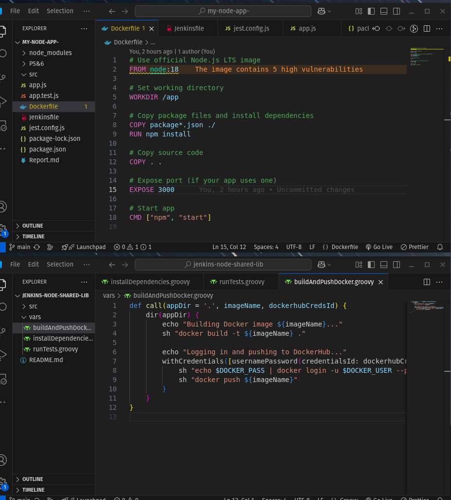
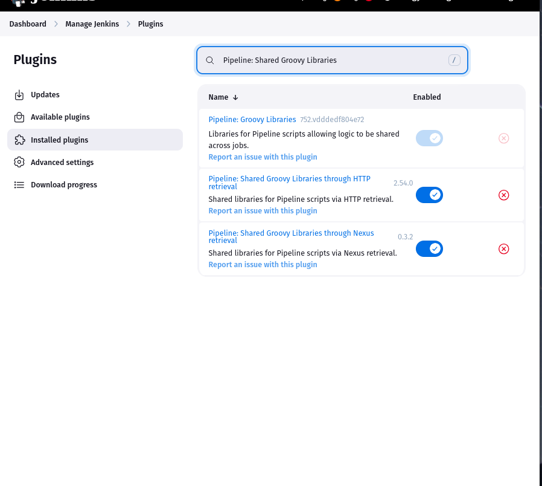
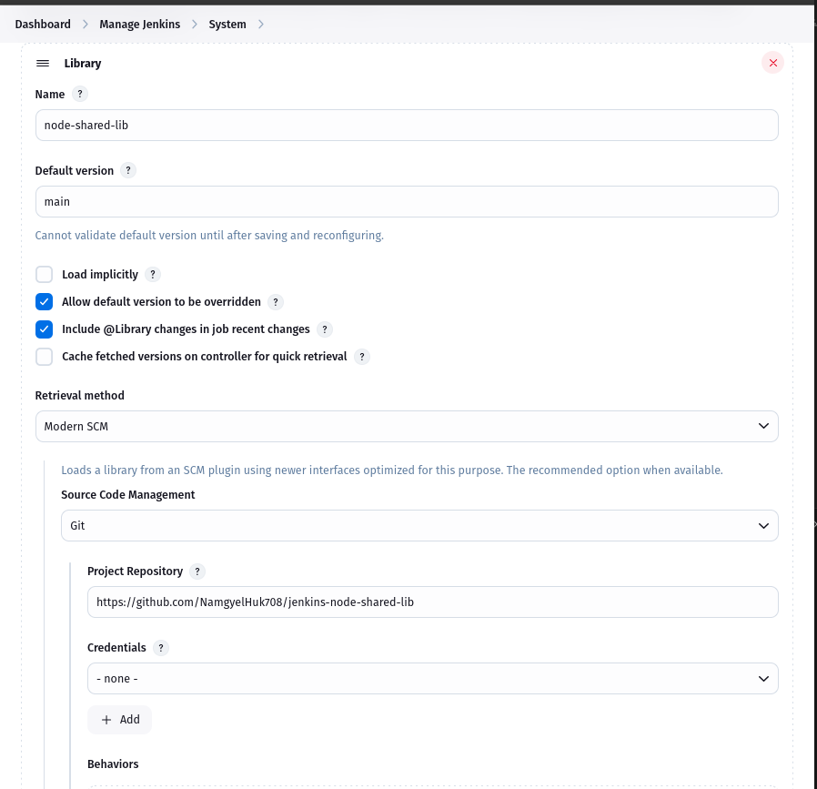
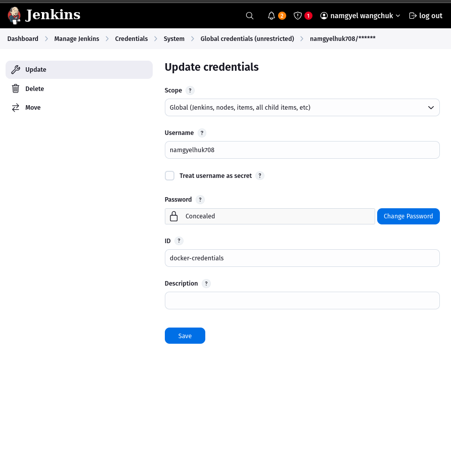
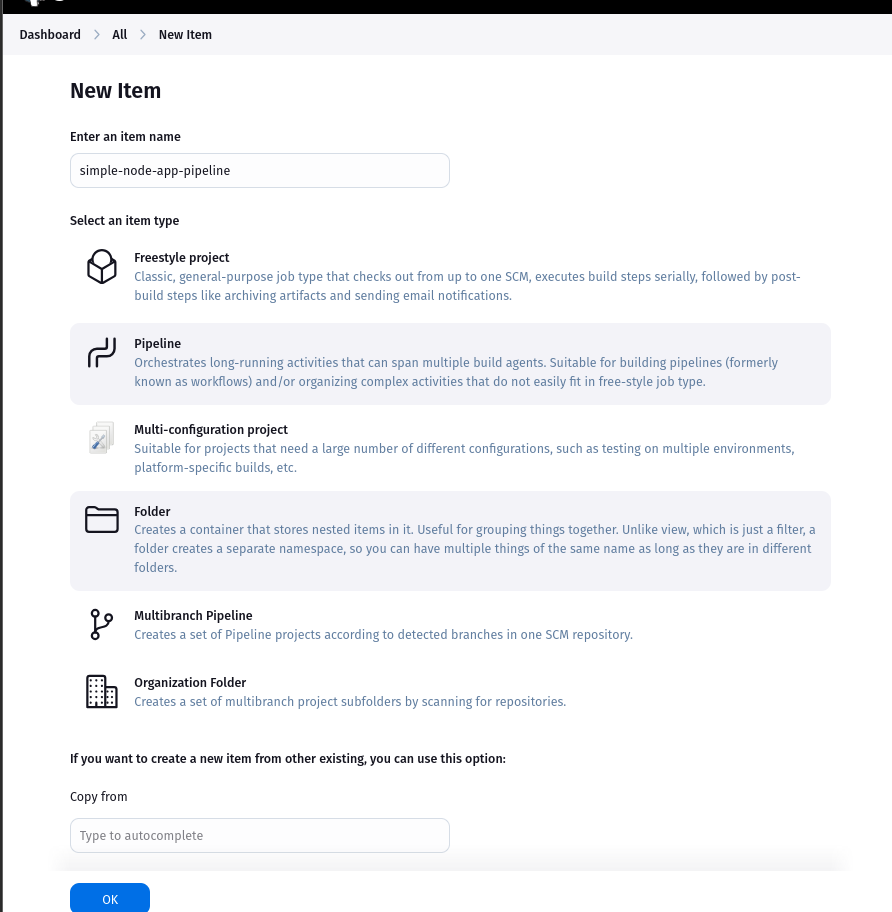
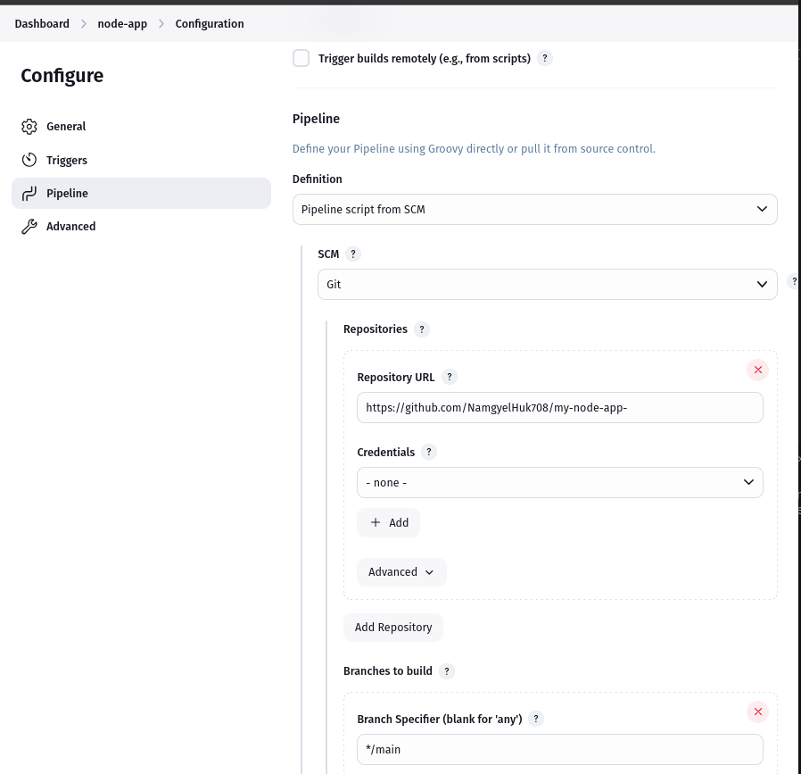
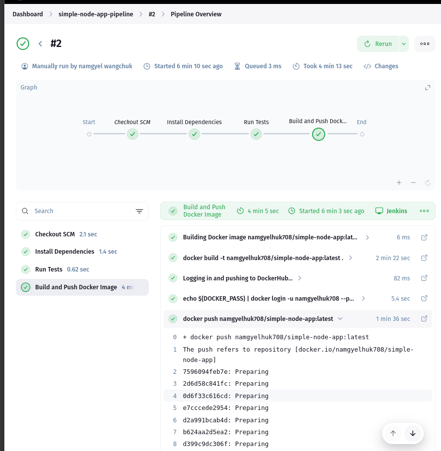
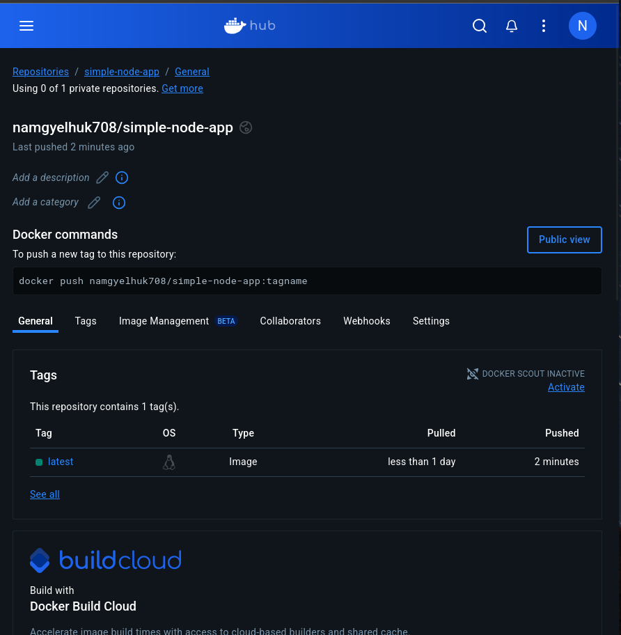

# Practical 7: Jenkins Shared Library for Node.js Applications

## Objective

The objective of this practical was to create a reusable Jenkins Shared Library to centralize common CI/CD pipeline logic for Node.js applications. The shared library simplifies tasks like installing dependencies, running tests, building Docker images, and pushing artifacts to DockerHub, making pipelines more consistent and maintainable across multiple projects.


## Project Structure

### 1. Node.js Application Repository

**Repository:** simple-node-app

**Contents:**
- app.js: Basic Node.js app
- package.json: Includes a start script
- Dockerfile: Builds and runs the app in a container
- Jenkinsfile: CI/CD logic using the shared library

### 2. Jenkins Shared Library Repository

**Repository:** jenkins-node-shared-lib

**Contents:**
- vars/installDependencies.groovy: Installs dependencies
- vars/runTests.groovy: Runs tests
- vars/buildAndPushDocker.groovy: Builds Docker image and pushes to DockerHub



## Implementation Steps

### Step 1: Create Shared Library

Created the jenkins-node-shared-lib repository with:

```groovy
// installDependencies.groovy
def call(String appDir = '.') {
    dir(appDir) {
        echo 'Installing dependencies...'
        sh 'npm install'
    }
}

// runTests.groovy
def call(String appDir = '.') {
    dir(appDir) {
        echo 'Running tests...'
        sh 'npm test || true'  // Allow empty test scripts
    }
}

// buildAndPushDocker.groovy
def call(String appDir, String imageName, String credentialsId) {
    dir(appDir) {
        echo "Building Docker image ${imageName}..."
        sh "docker build -t ${imageName} ."
        withCredentials([usernamePassword(credentialsId: credentialsId, usernameVariable: 'DOCKERHUB_USER', passwordVariable: 'DOCKERHUB_PASS')]) {
            sh "echo $DOCKERHUB_PASS | docker login -u $DOCKERHUB_USER --password-stdin"
            sh "docker push ${imageName}"
        }
    }
}
```

### Step 2: Configure Shared Library in Jenkins

- Installed "Pipeline: Shared Groovy Libraries" plugin.
- Navigated to Manage Jenkins → Configure System
- Added Global Shared Library:
  - Name: node-shared-lib
  - Version: main
  - SCM: Git → jenkins-node-shared-lib

### Step 3: Create Node.js App

- Created a simple Node.js app with npm init -y
- Added start script to package.json
- Created app.js with:

```javascript
console.log("App is running!");
```

- Created a working Dockerfile:

```dockerfile
FROM node:18
WORKDIR /app
COPY package*.json ./
RUN npm install
COPY . .
EXPOSE 3000
CMD ["npm", "start"]
```

### Step 4: Jenkinsfile Using Shared Library

Added Jenkinsfile in root of the app repo:

```groovy
@Library('node-shared-lib') _  

pipeline {
    agent any

    environment {
        IMAGE_NAME = 'namgyelhuk708/simple-node-app:latest'
        APP_DIR = '.'
        DOCKERHUB_CREDENTIALS_ID = 'dockerhub-credentials'
    }

    stages {
        stage('Install Dependencies') {
            steps {
                installDependencies(APP_DIR)
            }
        }
        stage('Run Tests') {
            steps {
                runTests(APP_DIR)
            }
        }
        stage('Build and Push Docker Image') {
            steps {
                buildAndPushDocker(APP_DIR, IMAGE_NAME, DOCKERHUB_CREDENTIALS_ID)
            }
        }
    }
}
```

### Step 5: Create and Run Jenkins Pipeline Job
**REQUIREMENT**
1. Install Required Plugin (Pipeline: Shared Groovy Libraries)



2. Add Global Shared Library Configuration



3. Update the crenditials 



4. Created a pipeline job: simple-node-app-pipeline
- SCM: Git → simple-node-app
- Script Path: Jenkinsfile



- Ran the pipeline:
  - Installed dependencies
  - Ran test step (no tests present but handled gracefully)
  - Built Docker image
  - Pushed image to DockerHub: namgyelhuk708/simple-node-app:latest

  

 

## Challenges Faced & Solutions

| Challenge | Description | Solution |
|-----------|-------------|----------|
| 1. Dockerfile Error | Build failed: "file with no instructions" | Dockerfile had only commented lines. Added valid build steps |
| 2. Jenkinsfile Not Detected | Pipeline failed due to incorrect Jenkinsfile path | Ensured Jenkinsfile was at repo root |
| 3. Docker Push Fails | Jenkins couldn't push to DockerHub | Created and used proper credentials ID in Jenkins |
| 4. runTests failed | No tests were defined | Updated script to allow test failure (non-blocking) |

## Learning Outcomes

- **Jenkins Shared Library Architecture:** Understood how Jenkins shared libraries are structured with vars/, src/, and resources/ directories
- **Pipeline as Code:** Successfully reused Jenkins logic across projects
- **Groovy Scripting:** Gained experience with function definitions, environment variables, and Jenkins DSL
- **Docker & CI/CD:** Built and pushed Docker images directly from Jenkins

## Final Output

- Shared Jenkins Library working and reusable
- Node.js app pipeline runs:
  - Installs dependencies
  - Runs tests
  - Builds Docker image
  - Pushes image to DockerHub
- **Docker Image:** 


## Conclusion

This practical demonstrated how to set up and use a Jenkins Shared Library to streamline CI/CD processes for Node.js applications. The modular approach reduced repetition, improved clarity, and ensured consistent build steps across multiple projects. These techniques are highly relevant in real-world DevOps and enterprise software pipelines.

Repository Links
https://github.com/NamgyelHuk708/my-node-app-
https://github.com/NamgyelHuk708/jenkins-node-shared-lib