# Docker compose 
Introduce fundamental concepts of Docker Compose by guiding through the development of a basic Python web application. It uses the Flask framework, the application features a hit counter in Redis, providing a practical example of how Docker Compose.

## Step 1: Set up
1. Creating a directory for the project

2. Creating a **app.py** in the project directory 
- Here the redis is the hostname of the redis container on the application's network and the default port, 6379 is used.

3. Creating **requirement.txt** in the projec directory

4. Creating a **Docker file**

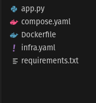

## Step 2: Define services in a Compose file
Compose simplifies the control of the entire application stack, making it easy to manage services, networks, and volumes in a single, comprehensible YAML configuration file.

1. Creating a **compose.yaml** (defines two services: web and redis) in the project directory
- The web service uses an image that's built from the Dockerfile in the current directory. It then binds the container and the host machine to the exposed port, 8000. This example service uses the default port for the Flask web server, 5000.
- The redis service uses a public Redis
image pulled from the Docker Hub registry.

## Step 3: Build and run your app with Compose
1. From the project directory, starting up the application by running **docker compose up.**
- Compose pulls a Redis image, builds an image for the code, and starts the services that was defined. In this case, the code is statically copied into the image at build time.

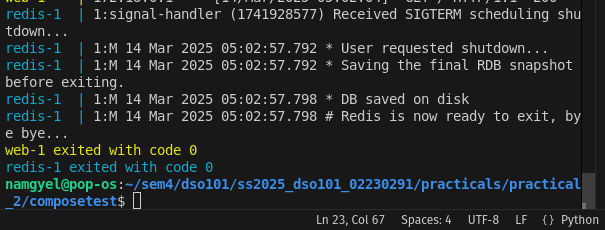

2. Entering **http://localhost:8000/** in a browser to see the application running. And upon refresing the increment of the number can be observed

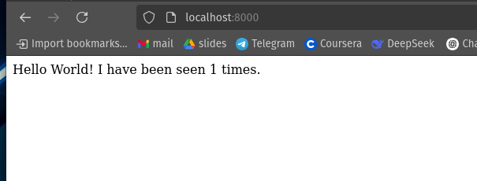

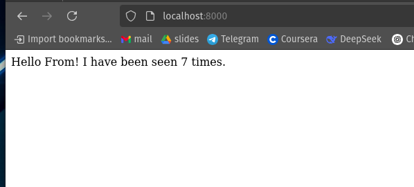

3. Switch to another terminal window, and type docker image ls to list local images.

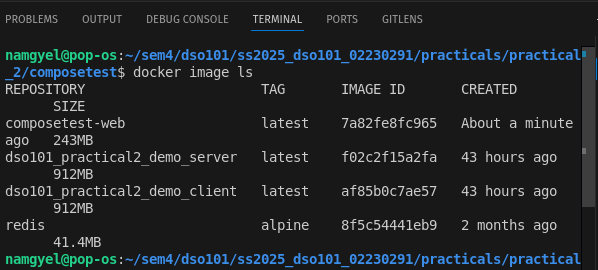
 
4. Stop the application, either by running **docker compose down** from within the project directory in the second terminal, or by hitting CTRL+C in the original terminal where it started the app.

## Step 4: Edit the Compose file to use Compose Watch
1. Edit the compose.yaml file in the project directory to use watch so that we can preview the running Compose services which are automatically updated as we edit and save the code.
- Whenever a file is changed, Compose syncs the file to the corresponding location under /code inside the container. Once copied, the bundler updates the running application without a restart.

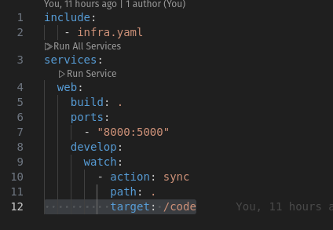\

## Step 5: Re-build and run the app with Compose
1. From the project directory, type **docker compose watch or docker compose up --watch** to build and launch the app and start the file watch mode.

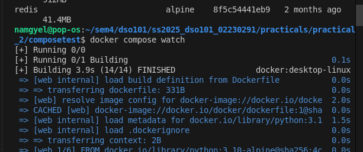

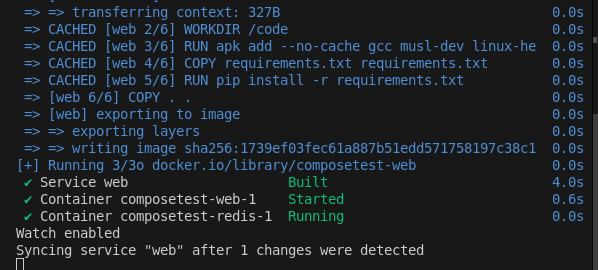

2. Enter **http://localhost:8000/** in a browser to see the application running.

## Step 6: Update the application
To see Compose Watch in action:

1. Change the greeting in app.py and save it. For example, change the Hello World! message to Hello from Docker! and view it in the exposed port.

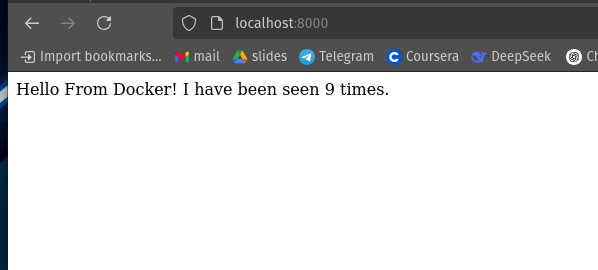

2. Once its done, run **docker compose down**.

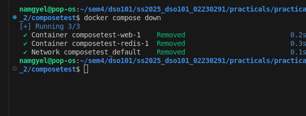

## Step 7: Split up the services
Using multiple Compose files lets us customize a Compose application for different environments or workflows. This is useful for large applications that may use dozens of containers, with ownership distributed across multiple teams.
1. In the project folder, create a new Compose file called **infra.yaml.**
2. Cut the Redis service from the compose.yaml file and paste it into the new infra.yaml file. Make sure we add the services top-level attribute at the top of our file.
3. In the compose.yaml file, add the include top-level attribute along with the path to the infra.yaml file.
4. Run **docker compose up** to build the app with the updated Compose files, and run it. We should see the Hello world message in the browser.

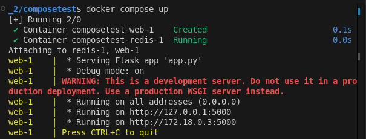

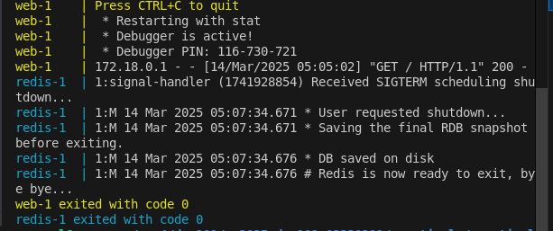

This is a simplified example, but it demonstrates the basic principle of include and how it can make it easier to modularize complex applications into sub-Compose files. 

## Step 8: Experiment with some other commands
1. If we want to run the services in the background, we can pass the -d flag (for "detached" mode) to docker compose up and use docker compose ps to see what is currently running.

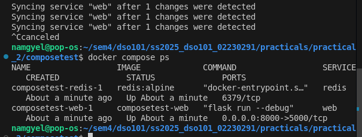

- Run docker compose --help to see other available commands.
- If we started Compose with docker compose up -d, stop the services once we are finished with them

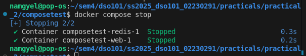

- We can bring everything down, removing the containers entirely, with the docker compose down command.

## Conclusion

Docker Compose simplifies managing multi-container applications by defining services in a single YAML file. This guide covered setting up a Flask app with Redis, using Compose Watch for live updates, and splitting services for better modularity. With these basics, we can efficiently orchestrate and scale containerized applications.

The work through https://docs.docker.com/compose/gettingstarted/#step-1-set-up