# Basic Docker Containerization

## Introduction
This pratical explains how to containerize a React application using Docker. It covers setting up a Dockerfile, running the application in a container, using Docker Compose, and optimizing with a multi-stage build.

## Basic Docker Containerization

### Step 1: Initialize
Clone the repo and run it locally to ensure that the application is functioning correctly before containerizing it.

### Step 2: Create a Dockerfile on the Root Working Directory
Create a `Dockerfile.test` under the root directory of the React app. The Dockerfile contains instructions on how to build the Docker image for the application.


### Step 3: Build the Docker Image
Build the Docker image using the following command:

```sh
docker build -f Dockerfile.test -t namgyelhuk708/react-app .
```

This creates a Docker image that contains the application and its dependencies, ready to be run as a container.

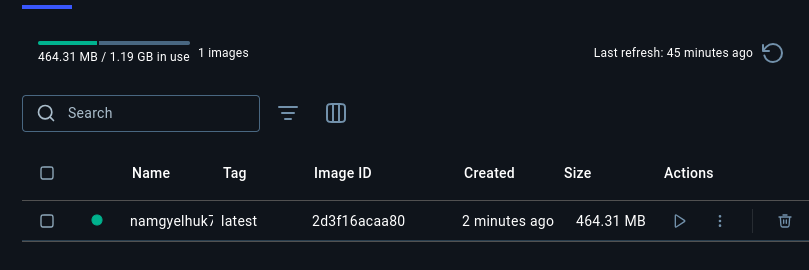

### Step 4: Run the Docker Container
Run the Docker container with port forwarding and volume mounting:

```sh
docker run -d -p 3000:3000 -v /app/node_modules -v $(pwd):/app namgyelhuk708/react-app
```

This starts the application inside a Docker container and makes it accessible on your local machine via `localhost:3000`.

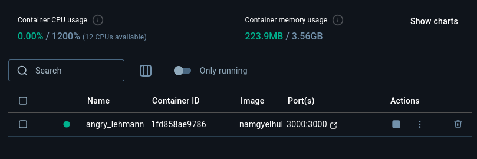

### Step 5: Verify the Application
Open a web browser and navigate to:

```
http://localhost:3000
```

Check that the container is running using:

```sh
docker ps
```


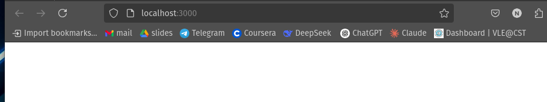

### Step 6: Stop the Container
To stop the running container, first check the container ID:

```sh
docker ps
```

Then stop the container using:

```sh
docker stop [container_id]
```

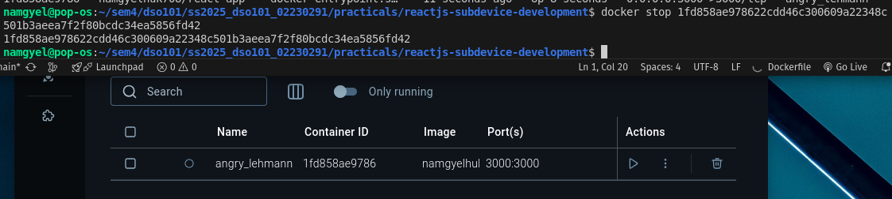

### Step 7: Create a `docker-compose.yml` File
Create a `docker-compose.yml` file to define and run multi-container Docker applications. This simplifies running multiple services (e.g., web and test) with a single command.

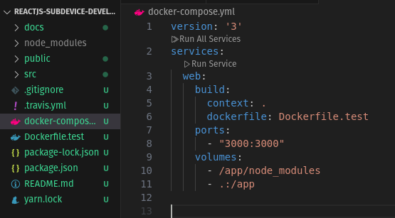

### Step 8: Start the Services with Docker Compose
Start the services defined in `docker-compose.yml` using:

```sh
docker compose up -d --build
```

This runs both the web and test services with a single command.

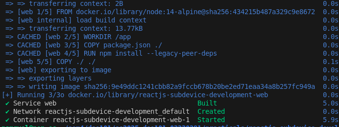

### Step 9: Verify the Services
Check that both the web and test services are running:

```sh
docker ps
```

To interact with a running Docker container using the interactive shell:

```sh
docker exec -it 'web container id' sh
```

Then use:

```sh
npm start
```

To exit the shell, use:

```sh
exit
```

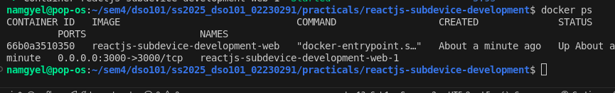

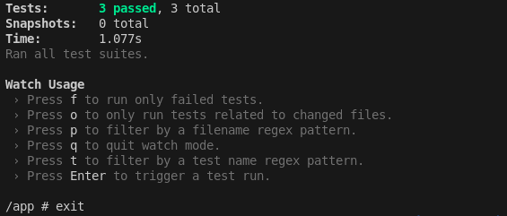

### Step 10: Update the `docker-compose.yml`
Make necessary updates to the `docker-compose.yml` file as needed.

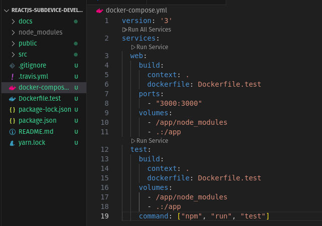

### Step 11: Stop the Services
To stop the running services:

```sh
docker compose stop
```

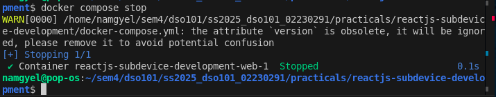

## Multi-Step Build Process with Different Base Images

### Step 1: Create a New Dockerfile
Create a new Dockerfile for the multi-step build process.

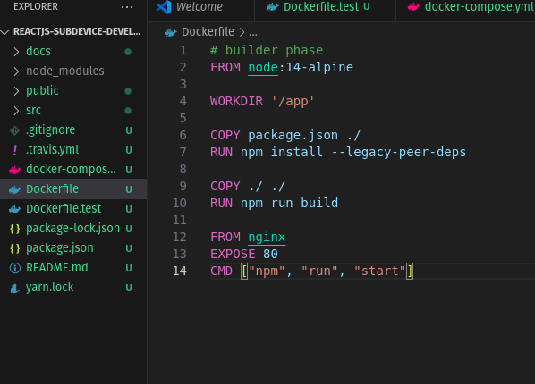

### Step 2: Run the Docker Container
Use the following command:

```sh
docker compose up -d --build
```

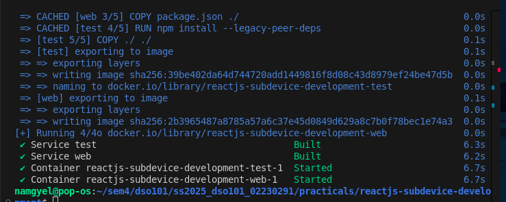

### Step 3: Verify the Services
Check the running containers:

```sh
docker ps
```

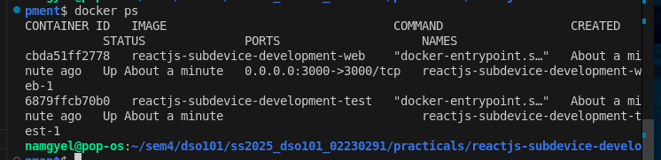

### Step 4: Stop the Services
To stop the running services:

```sh
docker compose stop
```


### Step 5: Remove `Dockerfile.test` and Rebuild
Remove `Dockerfile.test` and run:

```sh
docker build .
```

This will generate an image ID.

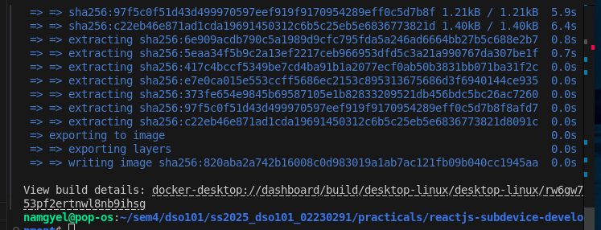

### Step 6: Start the Multi-Phase Container
Use the generated image ID to start the container:

```sh
docker run -d -p 80:80 [image_id]
```

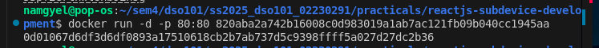


## Conclusion
By following these steps, we had successfully containerized a React application using Docker, enabling seamless deployment across different environments.
