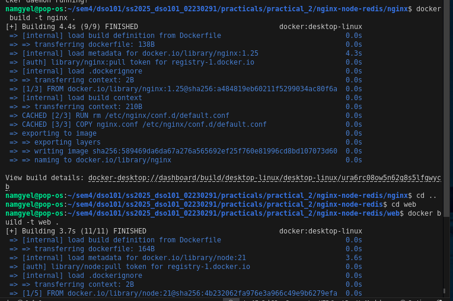
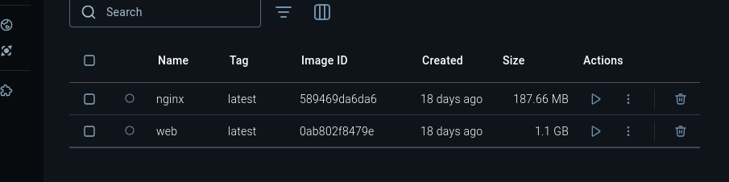
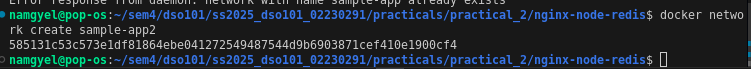
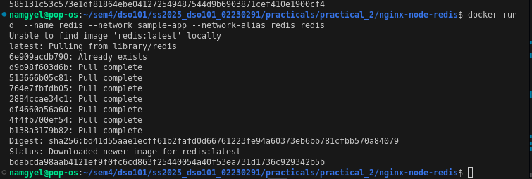
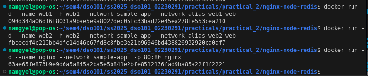
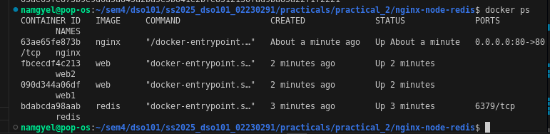
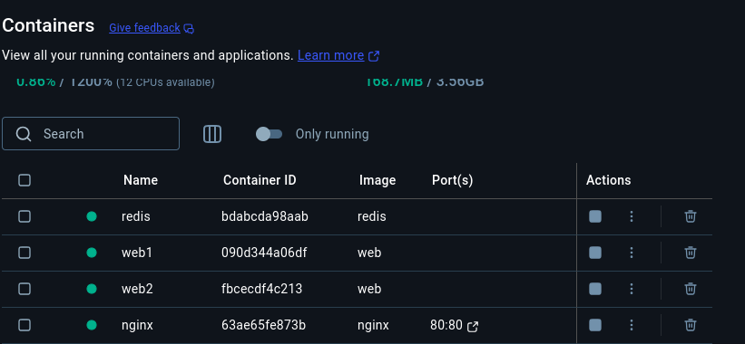
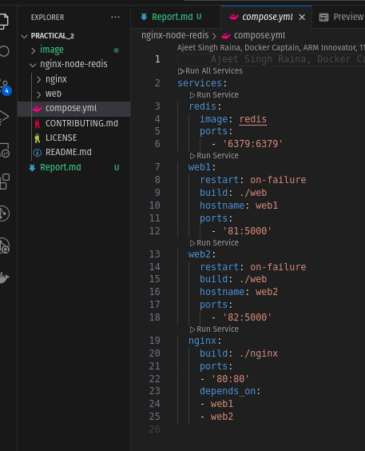
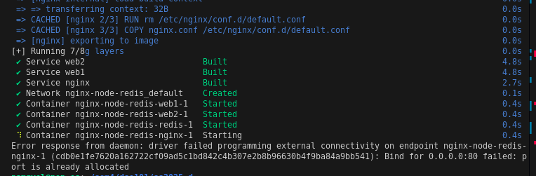
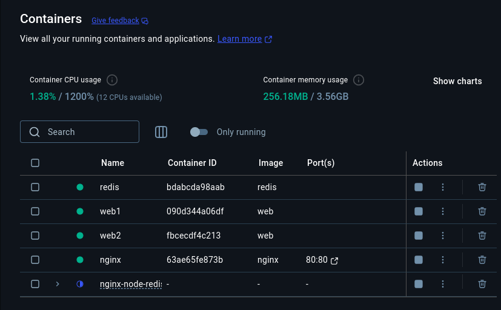

# Practicals 2: Docker Networking and Container to Container Communication

## Overview
Docker networking enables seamless communication between containers, allowing microservices to work together efficiently. In this practical, we explore how to set up a network and enable container-to-container communication using Docker. We will build and deploy a sample application consisting of Nginx, Node.js, and Redis containers, and later simplify the deployment using Docker Compose.

## Procedure Followed

### 1. Set Up
Clone the sample application repository:
```bash
git clone https://github.com/dockersamples/nginx-node-redis
```

### 2. Build the Images
Navigate and build the images in the respective directories:
```bash
docker build -t nginx .
docker build -t web .
```





### 3. Run the Containers
Create a network for the containers to communicate:
```bash
docker network create sample-app
```



Start the Redis container:
```bash
docker run -d --name redis --network sample-app --network-alias redis redis
```




Start the web containers and Nginx container:
```bash
docker run -d --name web1 -h web1 --network sample-app --network-alias web1 web
docker run -d --name web2 -h web2 --network sample-app --network-alias web2 web
docker run -d --name nginx --network sample-app -p 80:80 nginx
```



Verify the containers:
```bash
docker ps
```





Open http://localhost:80 in the browser to see the site. Refresh the page several times to see the host handling the request and the total number of requests.


## Simplify Deployment Using Docker Compose

Docker Compose provides a structured and streamlined approach for managing multi-container deployments.



### Steps Followed
1. Use the Docker Compose command to start the application:

```bash
docker compose up -d --build
```



2. View the details in Docker Desktop Dashboard.



## Conclusion
This practical demonstrated how Docker networking allows containers to communicate with each other efficiently. By manually setting up a network and running containers, we ensured that services like Nginx, Node.js, and Redis worked together.Additionally, Docker Compose simplified the deployment process, making it easier to manage and scale multi-container applications

Work through https://docs.docker.com/get-started/docker-concepts/running-containers/multi-container-applications/