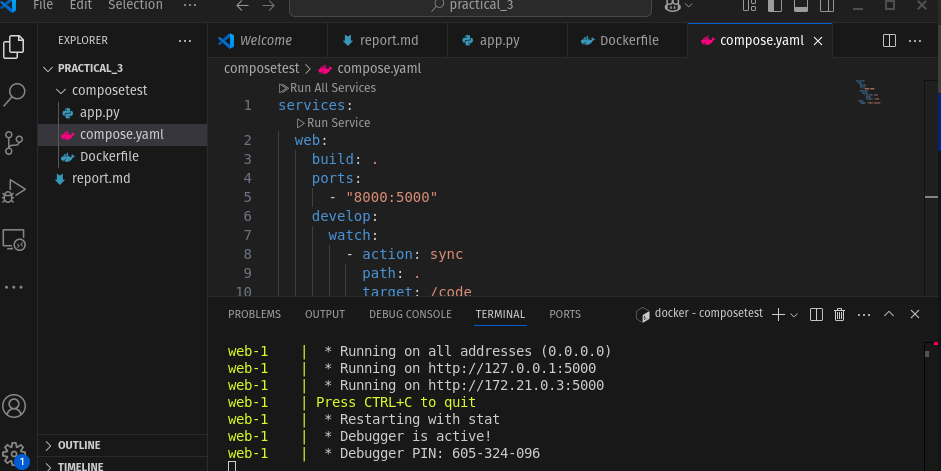
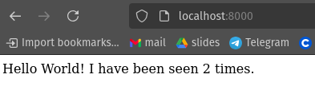
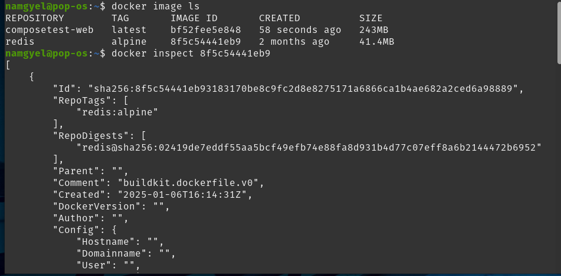
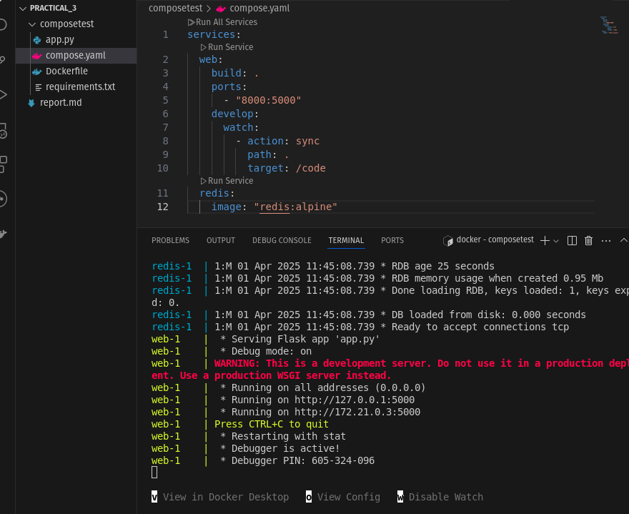
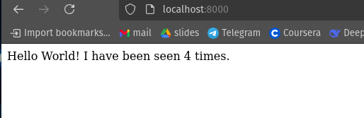
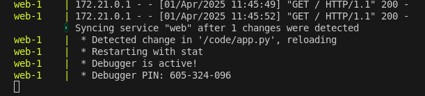
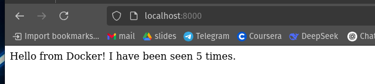
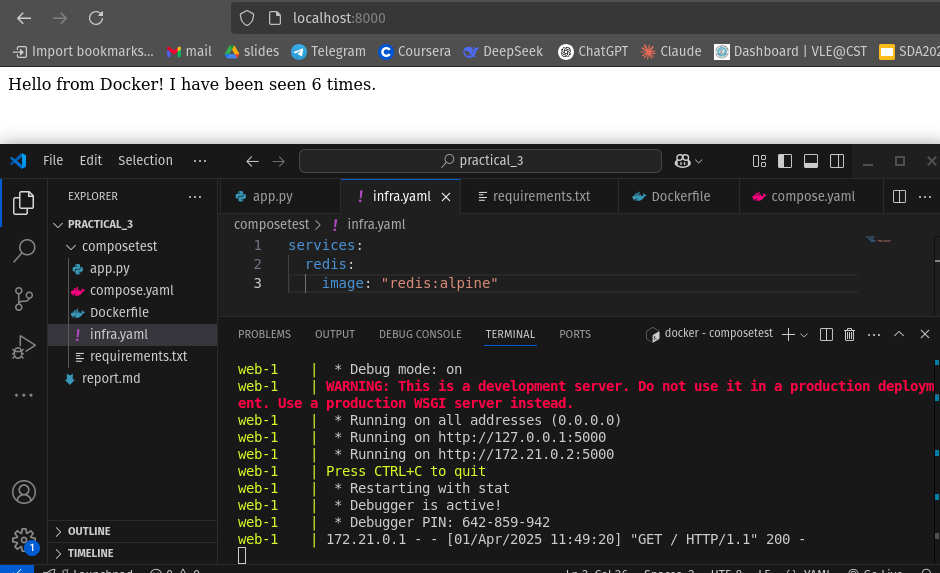
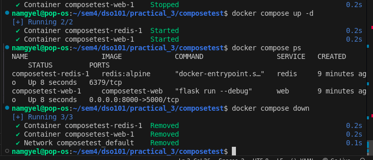

# Docker Compose Quickstart Report

## Introduction

This report summarizes the key steps and learnings from the Docker Compose tutorial, which demonstrates how to containerize a Python Flask application with Redis using Docker Compose.

## Steps & Instructions

### Step 1: Set Up the Project

- Create a project directory:
  ```bash
  mkdir composetest 
  cd composetest
  ```
- Create `app.py` (Flask app with Redis counter)
- Define dependencies in `requirements.txt` (Flask & Redis)
- Write a `Dockerfile` to containerize the Python app  
  **Key Action:** Ensure the `Dockerfile` has no extension (e.g., `.txt`)

### Step 2: Define Services in `compose.yaml`

- Create `compose.yaml` with two services:
  - **web** (built from the `Dockerfile`, maps port `8000:5000`)
  - **redis** (uses the `redis:alpine` image)

### Step 3: Build and Run with Docker Compose

- Start services:
  ```bash
  docker compose up
  ```



- Access the app at `http://localhost:8000`
- Refresh to see the counter increment



- Switch to another terminal window, and type ***docker image ls*** to list local images.
- You can inspect images ***with docker inspect*** tag or id.



- Stop with `CTRL+C` or:
  ```bash
  docker compose down
  ```


### Step 4: Enable Compose Watch for Live Updates

- Modify `compose.yaml` to include `develop.watch` for automatic file syncing
- Ensures code changes are reflected without manual restarts

### Step 5: Rebuild and Run with Watch Mode

- Start with auto-reload:
  ```bash
  docker compose watch
  ```
- Test changes (e.g., modify `app.py` and see updates in the browser)





### Step 6: Update the Application

- Edit `app.py` (e.g., change greeting message)
- Observe live updates in the browser





### Step 7: Modularize with Multiple Compose Files

- Split services into `infra.yaml` (Redis) and reference it in `compose.yaml` using `include`
- Run with:
  ```bash
  docker compose up
  ```



### Step 8: Experiment with Commands

- Run in detached mode:
  ```bash
  docker compose up -d
  ```
- Check running services:
  ```bash
  docker compose ps
  ```
- Stop services:
  ```bash
  docker compose stop
  ```
- Remove containers:
  ```bash
  docker compose down
  ```



## Conclusion & Key Learnings

This tutorial provided hands-on experience with Docker Compose, demonstrating how to:

- Containerize a Python Flask app with Redis using Docker
- Define multi-service applications in `compose.yaml`
- Use Compose Watch for live code updates without manual rebuilds
- Modularize configurations by splitting services into multiple Compose files
- Manage containers efficiently with commands like `up`, `ps`, `stop`, and `down`

## Key Takeaways:

✔ **Docker Compose simplifies multi-container orchestration**  
✔ **Live reloading (`watch`) speeds up development**  
✔ **Modular YAML files improve maintainability**  
✔ **Detached mode (`docker compose up -d`) allows background execution**

Work through https://docs.docker.com/compose/gettingstarted/
